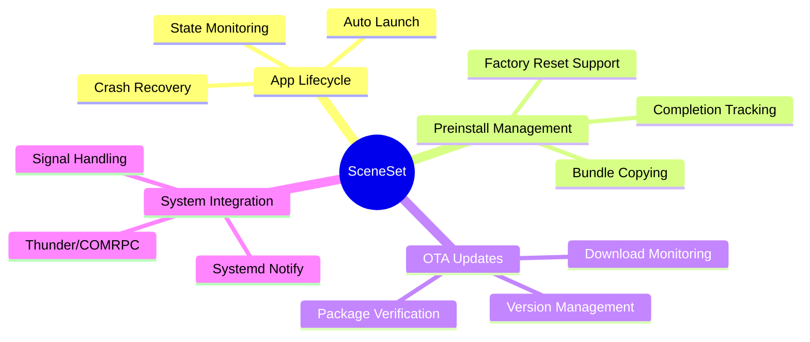
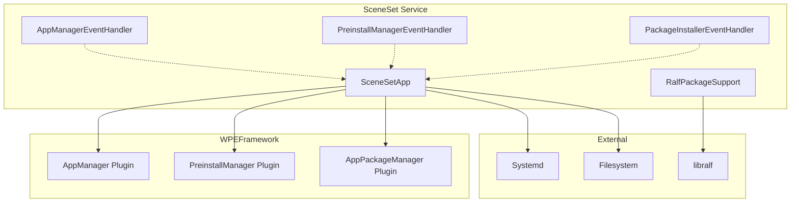

# SceneSet Documentation

This documentation provides comprehensive technical details about the SceneSet application launcher service for RDK-based Set-Top Boxes.

## Overview

SceneSet is a systemd-managed service that automatically launches the RDK reference application during system boot. It integrates with the WPEFramework (Thunder) ecosystem to manage application lifecycle, preinstallation of app bundles, and over-the-air (OTA) updates.

## Documentation Index

| Document | Description |
|----------|-------------|
| [Architecture Overview](./docs/architecture.md) | High-level system design, component interactions, and architectural diagrams |
| [RALF Package Support](./docs/ralf-package-support.md) | Package verification and metadata extraction using libralf |
| [Configuration Guide](./docs/configuration.md) | Build-time and runtime configuration options |
| [Telemetry Guide](./docs/sceneset-telemetry.md) | Home app launch/relaunch telemetry marker contract and payload fields |
| [Testing Guide](./Tests/testing.md) | Test infrastructure, coverage, and testing strategies |

## Quick Links

- **Source Code**: [`src/`](./src/)
- **Tests**: [`Tests/L1Tests/`](./Tests/L1Tests/)
- **Systemd Service**: [`systemd/sceneset.service`](./systemd/sceneset.service)
- **Build Configuration**: [`CMakeLists.txt`](./CMakeLists.txt)

## Key Features

## System Requirements

- **WPEFramework** (Thunder) with the following plugins:
  - `org.rdk.AppManager`
  - `org.rdk.PreinstallManager`
  - `org.rdk.AppPackageManager`
- **libralf** for RALF package verification
- **libsystemd** for systemd integration
- **C++17** compatible compiler

## Architecture at a Glance

## Getting Started

1. **Build the project** - See [Configuration Guide](./configuration.md#build-instructions)
2. **Configure the service** - Set appropriate CMake variables or runtime config files
3. **Deploy** - Install the `sceneset` binary and systemd service file
4. **Enable** - `systemctl enable sceneset.service`

## License

Copyright 2024-2026 RDK Management. Licensed under the Apache License, Version 2.0.
