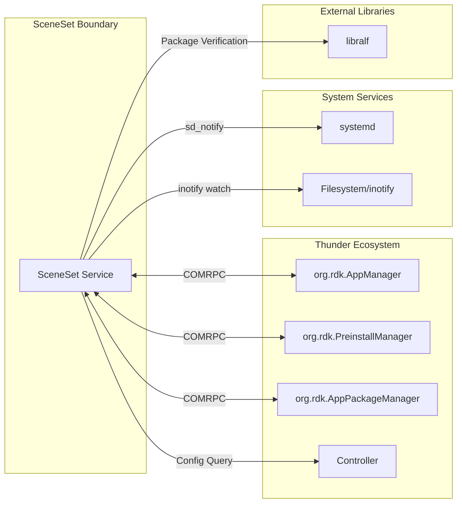
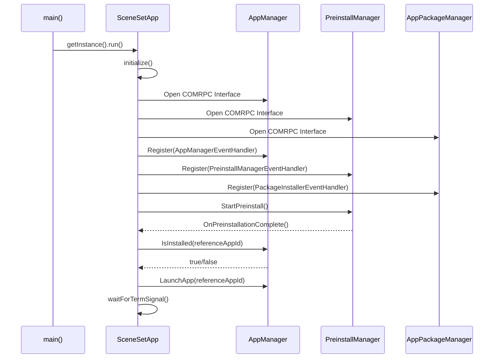
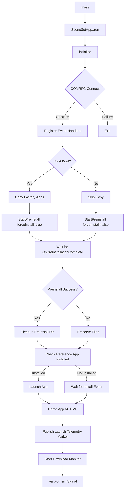
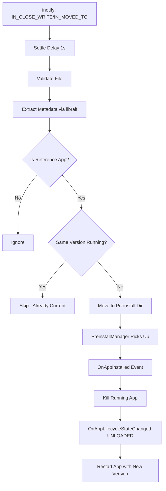

# SceneSet Architecture Overview

## 1. High-Level Purpose & Architecture

### Role in RDK Infrastructure

SceneSet serves as the **application launcher orchestrator** for RDK-based Set-Top Boxes. It bridges the gap between system boot completion and user-facing application availability by:

- Acting as the first-party coordinator for reference application lifecycle
- Managing the preinstallation pipeline for app bundles
- Enabling over-the-air (OTA) application updates without manual intervention

### Responsibilities

| Responsibility | Description |
|----------------|-------------|
| **App Launch Orchestration** | Automatically launches the configured reference application after system initialization |
| **Preinstall Coordination** | Triggers and monitors app bundle preinstallation via PreinstallManager |
| **Factory Reset Handling** | Detects first boot and copies factory app bundles to the preinstall directory |
| **OTA Update Monitoring** | Watches download directories for new RALF packages and stages them for installation |
| **Crash Recovery** | Monitors app lifecycle and restarts the reference app on abnormal termination |
| **Launch Telemetry** | Emits `ENTS_INFO_Sceneset_LaunchTime` on home-app `ACTIVE` for launch timing and relaunch context |
| **Graceful Shutdown** | Handles SIGTERM/SIGINT signals to cleanly terminate the service |

### Interacting Subsystems



### What SceneSet Does NOT Do

- **Does NOT implement app execution** — Delegates to AppManager
- **Does NOT perform actual installation** — Delegates to PreinstallManager/AppPackageManager
- **Does NOT manage non-reference applications** — Only tracks the configured reference app
- **Does NOT implement download logic** — Only monitors for completed downloads

---

## 2. Architectural Overview

### Major Components

| Component | File | Purpose |
|-----------|------|---------|
| `SceneSetApp` | `src/SceneSet.h`, `src/SceneSet.cpp` | Main application class; singleton pattern; orchestrates all workflows |
| `AppManagerEventHandler` | `src/SceneSet.h` (nested class) | Handles app lifecycle events from AppManager |
| `PreinstallManagerEventHandler` | `src/SceneSet.h` (nested class) | Handles preinstallation completion events |
| `PackageInstallerEventHandler` | `src/SceneSet.h` (nested class) | Tracks per-package installation status |
| `ralf_support` | `src/RalfPackageSupport.h`, `src/RalfPackageSupport.cpp` | Package metadata extraction and verification |

### Component Interaction Diagram



### High-Level Architecture Diagram

```
┌─────────────────────────────────────────────────────────────────────────────┐
│                              SceneSet Service                               │
├─────────────────────────────────────────────────────────────────────────────┤
│                                                                             │
│  ┌─────────────────────────────────────────────────────────────────────┐   │
│  │                         SceneSetApp (Singleton)                      │   │
│  │                                                                      │   │
│  │  ┌──────────────┐  ┌──────────────┐  ┌──────────────────────────┐   │   │
│  │  │ App Launch   │  │  Preinstall  │  │   Download Monitor       │   │   │
│  │  │ Thread       │  │  Completion  │  │   Thread                 │   │   │
│  │  │              │  │  Thread      │  │                          │   │   │
│  │  └──────────────┘  └──────────────┘  └──────────────────────────┘   │   │
│  │                                                                      │   │
│  │  ┌─────────────────────────────────────────────────────────────┐    │   │
│  │  │                     Event Handlers                           │    │   │
│  │  │  ┌─────────────┐ ┌─────────────┐ ┌─────────────────────┐    │    │   │
│  │  │  │AppManager   │ │Preinstall   │ │PackageInstaller     │    │    │   │
│  │  │  │EventHandler │ │EventHandler │ │EventHandler         │    │    │   │
│  │  │  └─────────────┘ └─────────────┘ └─────────────────────┘    │    │   │
│  │  └─────────────────────────────────────────────────────────────┘    │   │
│  └─────────────────────────────────────────────────────────────────────┘   │
│                                                                             │
│  ┌─────────────────────────────────────────────────────────────────────┐   │
│  │                    RalfPackageSupport Module                         │   │
│  │     ExtractPackageMetadata() ←── Certificate Cache (thread-safe)    │   │
│  └─────────────────────────────────────────────────────────────────────┘   │
│                                                                             │
└─────────────────────────────────────────────────────────────────────────────┘
                                      │
                                      │ COMRPC
                                      ▼
┌─────────────────────────────────────────────────────────────────────────────┐
│                         WPEFramework (Thunder)                              │
│  ┌─────────────────┐  ┌─────────────────┐  ┌─────────────────────────┐     │
│  │ org.rdk.        │  │ org.rdk.        │  │ org.rdk.                │     │
│  │ AppManager      │  │ PreinstallMgr   │  │ AppPackageManager       │     │
│  └─────────────────┘  └─────────────────┘  └─────────────────────────┘     │
└─────────────────────────────────────────────────────────────────────────────┘
```

---

## 3. Data Flow Overview

### Startup Flow



### OTA Update Flow



---

## 4. Threading Model

SceneSet employs multiple threads for concurrent operations:

| Thread | Purpose | Lifecycle |
|--------|---------|-----------|
| **Main Thread** | Signal handling via `sigwait()` | Entire service lifetime |
| **Launch Thread** | Async app launch to avoid blocking event handlers | Created on-demand, joined before next launch |
| **Download Monitor Thread** | inotify-based directory watching | Started after preinstall, stopped on shutdown |
| **Settle Worker Thread** | Delays processing of newly written files | Child of download monitor thread |
| **Preinstall Completion Thread** | Handles post-preinstall cleanup asynchronously | Created on OnPreinstallationComplete |

```mermaid
gantt
    title SceneSet Thread Lifecycle
    dateFormat X
    axisFormat %s

    section Main Thread
    initialize           :0, 1
    waitForTermSignal    :1, 10
    onTerminate          :10, 11

    section Launch Thread
    launchDefaultApp     :2, 3

    section Download Monitor
    monitorDownloadDirectory :3, 10

    section Preinstall Completion
    completeStartupAfterPreinstall :2, 3
```



---

## 5. Error Handling Strategy

SceneSet implements defensive error handling throughout:

1. **COMRPC Connection Failures**: Clean rollback of partially acquired interfaces
2. **Filesystem Errors**: Graceful degradation with error logging
3. **Signal Handling**: Blocked signals consumed via `sigwait()` for deterministic handling
4. **Thread Safety**: Mutexes protect shared state; atomic flags for cross-thread coordination
5. **Preinstall Failures**: Preserves preinstall directory contents for retry on next boot

---

## 6. Security Considerations

- **Package Verification**: All RALF packages verified against certificates in `DAC_APP_CERT_PATH`
- **Certificate Caching**: Thread-safe with mtime-based invalidation
- **Hidden File Filtering**: Download monitor ignores dotfiles to prevent processing of temp files
- **No Symlink Following**: Package verification rejects symlinks

---

## Next Steps

- [Core Components](./core-components.md) — Detailed class and method documentation
- [Configuration Guide](./configuration.md) — Build and runtime configuration options
