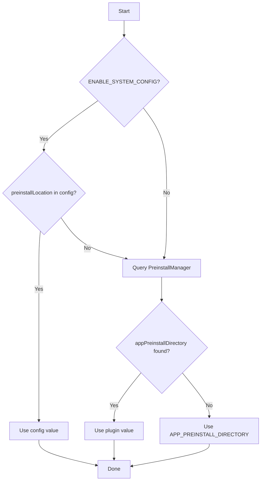

# SceneSet Configuration Guide

## 1. Overview

SceneSet supports configuration at three levels:
1. **Build-time** — CMake variables compiled into the binary
2. **Runtime files** — Configuration files read at startup
3. **Environment variables** — Runtime behavior overrides

```mermaid
flowchart LR
    subgraph Build Time
        A[CMake Variables]
    end
    subgraph Runtime
        B[/etc/sceneset.conf]
        C[/opt/sceneset.conf]
        D[/opt/sceneset_app.conf]
        E[Environment Variables]
    end
    subgraph Plugin Config
        F[AppPackageManager]
        G[PreinstallManager]
    end
    
    A --> H[sceneset binary]
    B --> H
    C --> H
    D --> H
    E --> H
    F --> H
    G --> H
```

---

## 2. Build-Time Configuration

### CMake Variables

| Variable | Type | Default | Description |
|----------|------|---------|-------------|
| `SCENESET_DEFAULT_APPNAME` | String | `""` (empty) | Default application ID to launch |
| `FACTORY_APP_PATH` | String | `""` (empty) | Path to factory app bundles for first-boot copy |
| `APP_PREINSTALL_DIRECTORY` | String | `""` (empty) | Fallback preinstall directory path |
| `DAC_APP_CERT_PATH` | String | `/etc/rdk/certs` | Directory containing DAC certificates |
| `ENABLE_SYSTEM_CONFIG` | Bool | `OFF` | Enable reading `/etc/sceneset.conf` |
| `ENABLE_CONFIG_OVERRIDE` | Bool | `OFF` | Enable `/opt/sceneset.conf` override layer |
| `RESTART_HOMEAPP_ALWAYS` | Bool | `OFF` | Restart app on any TERMINATING→UNLOADED transition |
| `SCENESET_TELEMETRY_METRICS_SUPPORT` | Bool | `OFF` | Enable SceneSet T2 launch/relaunch telemetry marker emission |
| `DISABLE_REFERENCE_APP_UPDATE` | Bool | `OFF` | Disable OTA update monitoring |

### Build Examples

**Minimal Build:**
```bash
cmake -B build \
    -DSCENESET_DEFAULT_APPNAME="com.rdkcentral.refui"
```

**Full Production Build:**
```bash
cmake -B build \
    -DSCENESET_DEFAULT_APPNAME="com.rdkcentral.refui" \
    -DFACTORY_APP_PATH="/etc/rdk/factoryapps" \
    -DAPP_PREINSTALL_DIRECTORY="/media/apps" \
    -DDAC_APP_CERT_PATH="/etc/rdk/certs" \
    -DENABLE_SYSTEM_CONFIG=ON \
    -DENABLE_CONFIG_OVERRIDE=ON
```

**Debug Build with Always-Restart:**
```bash
cmake -B build \
    -DCMAKE_BUILD_TYPE=Debug \
    -DSCENESET_DEFAULT_APPNAME="com.rdkcentral.refui" \
    -DRESTART_HOMEAPP_ALWAYS=ON
```

**Telemetry-Enabled Build:**
```bash
cmake -B build \
    -DSCENESET_DEFAULT_APPNAME="com.rdkcentral.refui" \
    -DSCENESET_TELEMETRY_METRICS_SUPPORT=ON
```

### CMake Validation Rules

```cmake
# FACTORY_APP_PATH requires APP_PREINSTALL_DIRECTORY
if(FACTORY_APP_PATH AND NOT APP_PREINSTALL_DIRECTORY)
    message(FATAL_ERROR "FACTORY_APP_PATH is set but APP_PREINSTALL_DIRECTORY is not set")
endif()

# Warnings for missing recommended values
if(NOT SCENESET_DEFAULT_APPNAME)
    message(WARNING "SCENESET_DEFAULT_APPNAME is not set")
endif()

if(NOT FACTORY_APP_PATH)
    message(WARNING "FACTORY_APP_PATH is not set")
endif()
```

---

## 3. Runtime Configuration Files

### 3.1 App Override File: `/opt/sceneset_app.conf`

**Purpose:** Override the reference app ID at runtime without rebuilding.

**Format:** Plain text file; first line is the app ID.

**Example:**
```text
com.rdkcentral.Netflix
```

**Priority:** Takes precedence over `SCENESET_DEFAULT_APPNAME` compile-time value.

**Code Reference** (from `src/SceneSet.cpp`):
```cpp
static std::string getDefaultAppName() {
    std::ifstream configFile(SCENESET_CONFIG_FILE);  // /opt/sceneset_app.conf
    if (configFile.is_open()) {
        std::string appName;
        std::getline(configFile, appName);
        if (!appName.empty()) {
            std::cout << "Using sceneset default app from config file: " << appName << std::endl;
            return appName;
        }
    }
    // Fall back to compile-time default
    std::string appDefault = SCENESET_DEFAULT_APPNAME;
    return appDefault;
}
```

---

### 3.2 System Config: `/etc/sceneset.conf`

**Requires:** `ENABLE_SYSTEM_CONFIG=ON` at build time.

**Format:** Key-value pairs (shell-style).

**Supported Keys:**

| Key | Purpose | Example |
|-----|---------|---------|
| `preinstallLocation` | Override preinstall directory | `/media/apps/preinstall` |
| `defaultHomeApp` | Override reference app ID | `com.rdkcentral.refui` |

**Example:**
```ini
# SceneSet system configuration
preinstallLocation=/media/apps/preinstall
defaultHomeApp=com.rdkcentral.refui
```

**Parsing Rules:**
- Lines starting with `#` are comments
- Empty lines are ignored
- Values can be quoted (`"value"` or `'value'`)
- Whitespace around `=` is trimmed

---

### 3.3 Override Config: `/opt/sceneset.conf`

**Requires:** Both `ENABLE_SYSTEM_CONFIG=ON` and `ENABLE_CONFIG_OVERRIDE=ON` at build time.

**Purpose:** Layer additional overrides on top of `/etc/sceneset.conf` (e.g., for field debugging).

**Format:** Same as system config.

**Priority:** Values in `/opt/sceneset.conf` override values from `/etc/sceneset.conf`.

---

## 4. Environment Variables

| Variable | Purpose | Default | Accepted Values |
|----------|---------|---------|-----------------|
| `THUNDER_ACCESS` | Path to Thunder COMRPC socket | `/tmp/communicator` | Filesystem path |
| `SCENESET_INITIAL_DOWNLOAD_SWEEP` | Process existing packages at monitor startup | `0` (disabled) | `1`, `true`, `yes`, `on` (enabled) |
| `SCENESET_SYSTEM_CONFIG_FILE` | Override path to system config | `/etc/sceneset.conf` | Filesystem path |
| `SCENESET_OVERRIDE_CONFIG_FILE` | Override path to override config | `/opt/sceneset.conf` | Filesystem path |

### Boolean Environment Variable Parsing

```cpp
bool isEnvFlagEnabled(const char* envVarName, const bool defaultValue) {
    const char* value = std::getenv(envVarName);
    if (value == nullptr) {
        return defaultValue;
    }

    std::string rawValue(value);
    // Convert to lowercase for comparison
    std::transform(rawValue.begin(), rawValue.end(), rawValue.begin(),
        [](unsigned char c) { return static_cast<char>(std::tolower(c)); });

    if (rawValue == "1" || rawValue == "true" || rawValue == "yes" || rawValue == "on") {
        return true;
    }
    if (rawValue == "0" || rawValue == "false" || rawValue == "no" || rawValue == "off") {
        return false;
    }

    // Invalid value - use default
    return defaultValue;
}
```

---

## 5. Plugin Configuration Resolution

SceneSet dynamically queries WPEFramework plugin configurations at runtime.

### Download Directory

**Source:** `org.rdk.AppPackageManager` plugin config, key `downloadDir`

**Fallback:** Empty (download monitoring disabled)

### Preinstall Directory

**Resolution Order:**
1. System config `preinstallLocation` (if `ENABLE_SYSTEM_CONFIG=ON`)
2. `org.rdk.PreinstallManager` plugin config, key `appPreinstallDirectory`
3. Compile-time `APP_PREINSTALL_DIRECTORY`



---

## 6. Configuration File Locations Summary

| File | Purpose | Requires Build Flag |
|------|---------|---------------------|
| `/opt/sceneset_app.conf` | Runtime app ID override | None |
| `/etc/sceneset.conf` | System-level configuration | `ENABLE_SYSTEM_CONFIG=ON` |
| `/opt/sceneset.conf` | Override layer | `ENABLE_CONFIG_OVERRIDE=ON` |
| `/opt/persistent/.sceneset_factory_apps_copied` | First-boot marker (internal) | None |

---

## 7. Systemd Service Configuration

**File:** `systemd/sceneset.service`

```ini
[Unit]
Description=Application launcher service
Requires=wpeframework-appmanager.service
After=wpeframework-appmanager.service

ConditionPathExists=/opt/ai2managers

[Service]
Type=notify
RemainAfterExit=Yes
StandardOutput=syslog
ExecStart=/usr/bin/sceneset

[Install]
WantedBy=multi-user.target
```

### Key Service Options

| Option | Value | Purpose |
|--------|-------|---------|
| `Type` | `notify` | Service uses `sd_notify()` to signal readiness |
| `Requires` | `wpeframework-appmanager.service` | Ensures AppManager is running |
| `After` | `wpeframework-appmanager.service` | Start order dependency |
| `ConditionPathExists` | `/opt/ai2managers` | Service only starts if path exists |
| `RemainAfterExit` | `Yes` | Service remains active after main process exits |

### Service Management

```bash
# Enable service at boot
systemctl enable sceneset.service

# Start service
systemctl start sceneset.service

# Check status
systemctl status sceneset.service

# View logs
journalctl -u sceneset.service -f
```

---

## 8. Configuration Precedence Summary

### Reference App ID

```
1. /opt/sceneset_app.conf (highest priority)
2. System config defaultHomeApp (if ENABLE_SYSTEM_CONFIG)
3. SCENESET_DEFAULT_APPNAME (compile-time)
```

### Preinstall Directory

```
1. System config preinstallLocation (if ENABLE_SYSTEM_CONFIG)
2. PreinstallManager plugin config appPreinstallDirectory
3. APP_PREINSTALL_DIRECTORY (compile-time)
```

### Download Directory

```
1. AppPackageManager plugin config downloadDir
2. (None - monitoring disabled if not configured)
```

---

## 9. Troubleshooting Configuration Issues

### Common Issues

| Symptom | Possible Cause | Resolution |
|---------|----------------|------------|
| No app launches | Empty `SCENESET_DEFAULT_APPNAME` and no override | Set app ID in config file or CMake |
| Preinstall fails | Invalid `APP_PREINSTALL_DIRECTORY` | Verify path exists and is writable |
| No OTA updates | Empty `downloadDir` from plugin | Configure `AppPackageManager` plugin |
| Factory apps not copied | `FACTORY_APP_PATH` not set | Set path at build time |

### Debugging Commands

```bash
# Check compiled defaults
strings /usr/bin/sceneset | grep -E "(SCENESET|FACTORY|PREINSTALL)"

# Check environment
echo $THUNDER_ACCESS
echo $SCENESET_INITIAL_DOWNLOAD_SWEEP

# Check config files
cat /opt/sceneset_app.conf
cat /etc/sceneset.conf 2>/dev/null
cat /opt/sceneset.conf 2>/dev/null

# Check marker file
ls -la /opt/persistent/.sceneset_factory_apps_copied
```

---

## Next Steps

- [Testing Guide](./testing.md) — Test configuration and coverage
- [Architecture Overview](./architecture.md) — System design details
